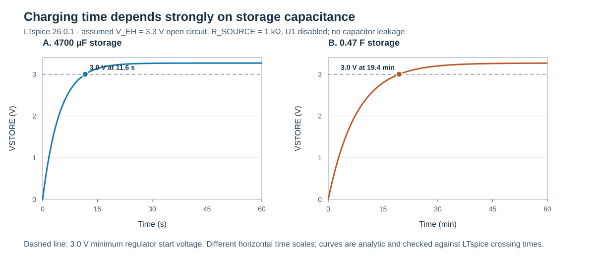

# Version 1 simulation — Step 1: storage charging

Run date: 2026-09-13. Operator: Codex on Sergio's laptop; design owner: Sergio. Simulation status: **LTspice run completed**; **KiCad/ngspice run not yet performed**. No hardware measurements are presented. The two simulation netlists match the Version 1 schematic with the regulator held disabled and no output load.

## Purpose and model

The question for Step 1 is how the two Version 1 capacitor options change the time to reach the buck-boost regulator's **3.0 V minimum start voltage**. The antenna/ST25DV energy-harvesting output is represented by a simple assumed Thévenin source, **not** by a validated ST25DV model:

| Quantity | Assumed value | Meaning |
|---|---:|---|
| Open-circuit `V_EH` | 3.3 V | Plausible illustrative source voltage, not a measured value |
| Source resistance | 1 kΩ | Illustrative current limitation; not an ST25DV specification |
| C1 | 10 nF | Version 1 input bypass, in parallel with storage |
| C2 or C3 | 4700 µF or 0.47 F | One storage capacitor fitted at a time |
| Disabled U1 input | 100 kΩ to GND | Proxy for the [Pololu EN pull-up](https://www.pololu.com/product/5712); approximately 10 µA per volt while disabled |
| Capacitor initial voltage | 0 V | Fully discharged initial condition |
| RF field | Continuous | No reader modulation, movement or interruption modelled |

The model deliberately omits supercapacitor leakage and equivalent series resistance, nonlinear tag source behaviour, antenna detuning, charge-control loss, the regulator's active operation, and loads. It is consequently a **first-order optimistic charging comparison**, not a prediction of charging time with Masixole's antenna. ST's [AN4913](https://www.st.com/resource/en/application_note/an4913-energy-harvesting-delivery-impact-on-st25dvi2c-series-behaviour-during-rf-communication-stmicroelectronics.pdf) shows why `V_EH` depends on RF field, coupling and load and why communication may fail when harvesting current is excessive. The note also uses 10 nF across `V_EH` in its characterisation, supporting C1 as an initial filter value. The source numbers above are chosen for a reproducible sensitivity baseline and are **not copied from AN4913**.

## LTspice results

| Storage fitted | `VSTORE` at 10 s | Time to 3.0 V | Time to 3.1 V | End-point voltage |
|---|---:|---:|---:|---:|
| 4700 µF (Test A) | 2.886 V | 11.649 s | 13.829 s | 3.267 V at 60 s |
| 0.47 F (Test B) | — | 1164.881 s = 19.41 min | 1382.907 s = 23.05 min | 3.266 V at 60 min |

For Test B, LTspice reports **2.367 V at 10 min** and **3.199 V at 30 min**. The larger capacitor takes roughly 100 times as long to cross 3.0 V in this linear model because its capacitance is about 100 times larger. These are simulated values only; neither capacitor nor the antenna has yet been tested physically.

The first-order network provides an independent calculation. With `R_S = 1 kΩ`, `R_OFF = 100 kΩ`, `V_OC = 3.3 V` and total capacitance `C = C1 + CSTORE`, the steady-state voltage is `V_∞ = V_OC R_OFF/(R_S+R_OFF) = 3.2673 V`. The time constant is `τ = (R_S || R_OFF)C`. Therefore `VSTORE(t) = V_∞[1 − exp(−t/τ)]`. This gives `τ = 4.6535 s` for Test A and `465.3465 s` for Test B. Calculated 3.0 V crossing times differ from the LTspice measurements by less than **0.2 ms**, verifying that the runs match the intended RC topology. This cross-check does **not** validate the assumed source against hardware.

Figure 1 shows the two distinct charging time scales. It does not show a measured antenna response.

Figure 1: Predicted charging of the two selectable storage capacitors under the assumed 3.3 V/1 kΩ `V_EH` source. The dashed line marks the regulator's 3.0 V start minimum. Curves are calculated from the linear RC equation and checked against LTspice crossing times.

## Reproducibility and next step

- [Step_1_Charge_4700uF.cir](Step_1_Charge_4700uF.cir) and [Step_1_Charge_0p47F.cir](Step_1_Charge_0p47F.cir) are the two LTspice-run SPICE decks. The `.log` files contain the actual simulator measurements and the `.raw` files contain its waveforms. The decks use ordinary R, C and V elements and can be recreated in KiCad's ngspice simulator; **they have not yet been run in KiCad**.
- [Step_1_Charge_Curves.csv](Step_1_Charge_Curves.csv) contains sampled *analytical* curves for plotting. [Step_1_Charge_Check.json](Step_1_Charge_Check.json) records the LTspice-versus-equation comparison. [plot_step_1.js](plot_step_1.js) regenerates both from the LTspice logs using `node plot_step_1.js`.
- **Step 2:** vary the assumed `V_EH` open-circuit voltage and source resistance, including a case that cannot reach 3.0 V. After Masixole provides measured `V_EH` under at least two known resistive loads, replace these assumptions with an estimated source model. Only then is it meaningful to simulate U1 enabling and a 3.3 V load pulse.

The [Pololu regulator specification](https://www.pololu.com/product/5712) is the source for the 3 V start threshold and disabled EN current. [KiCad's simulator documentation](https://docs.kicad.org/10.0/en/eeschema/eeschema.html) describes its integrated ngspice engine; KiCad replication remains an explicit verification item.
